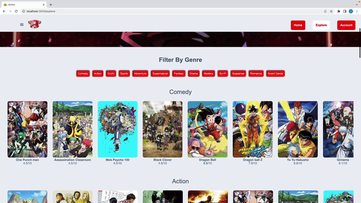
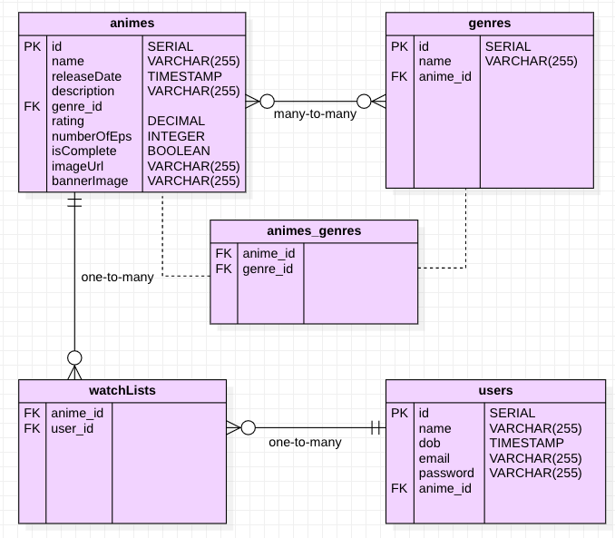
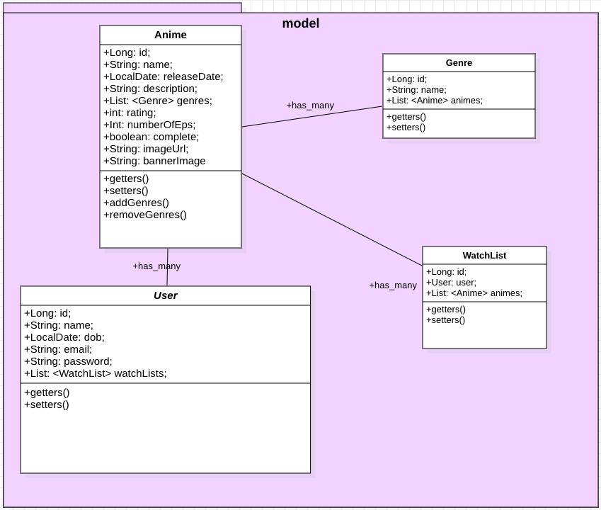

# Anime-Watch-List
Bright Network Techonolgy Academy Cohort 5a members: [James](https://github.com/jamesdpli), [Amber](https://github.com/aakamara), [Aisha](https://github.com/aisha-png), [Sujan](https://github.com/kagami7410) and [Mani](https://github.com/Kozmo119) present **Animu** a website where you can store your favourite anime into your personal watch-list.

### See Animu In Action!

### Wire Frame

### Entity Relationship Diagram

### UML Diagram

### All Working Routes
| HTTP Requests | Animes                                                                                                                                                                                                                                                                                                                                                                                        | Genres                                                     | WatchLists                                               |
|---------------|-----------------------------------------------------------------------------------------------------------------------------------------------------------------------------------------------------------------------------------------------------------------------------------------------------------------------------------------------------------------------------------------------|------------------------------------------------------------|----------------------------------------------------------|
| GET           | `localhost:8080/animes`   `localhost:8080/animes/{id}`   `localhost:8080/animes/name={name}`   `localhost:8080/animes/rating>{rating}`   `localhost:8080/animes/episodesGreaterThan>{numberOfEps}`   `localhost:8080/animes/episodesGreaterThan>{numberOfEps}`   `localhost:8080/animes/genre={genreName}`   `localhost:8080/animes/complete/animes={isComplete}` | `localhost:8080/genres`   `localhost:8080/genres/{id}` | `localhost:8080/users`   `localhost:8080/users/{id}` |
| POST          | `localhost:8080/animes`                                                                                                                                                                                                                                                                                                                                                                       | `localhost:8080/genres`                                    | `localhost:8080/users`                                   |
| PUT           | `localhost:8080/animes/{id}`                                                                                                                                                                                                                                                                                                                                                                  | `localhost:8080/genres/{id}`                               | `localhost:8080/users/{id}`                              |
| DELETE        | `localhost:8080/animes/{id}`                                                                                                                                                                                                                                                                                                                                                                  | `localhost:8080/genres/{id}`                               | `localhost:8080/users/{id}`                              |

### Quirky Behaviour 
- Delete mapping for the "animes" route works but an error is thrown.
- Async in front end must be fine-tuned

### How You Can Download This Project
1. Clone this repo -> `git clone git@github.com:jamesdpli/Anime-Watch-List.git`
2. Open the **server** folder in intelliJ IDEA (If you open up the server folder, and it is not compiling run `mvn clean install`)
3. Run the **AnimeWatchListApplication.java** file
4. Make sure Apache Tomcat has started on port 8080
5. Type `localhost:8080/animes` into your browser -> you should see a json format returned
6. Navigate into **anime-watch-list-frontend** using your terminal
7. Type `npm install` hit enter
8. Type `npm start` hit enter
9. Enjoy!

### Acknowledgement
Massive shout out to the Bright Network Technology Team especially Richard & Anna!
